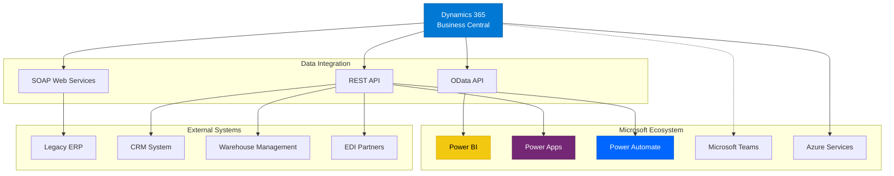

# Advanced Business Central Features

Take your Dynamics 365 Business Central implementation to the next level with these advanced features and capabilities.

## System Architecture

The following diagram illustrates how Business Central integrates with various Microsoft and third-party systems:

## API & Web Services

### OData Web Services
- **RESTful API access** to Business Central data
- Standard CRUD operations on entities
- Query capabilities with $filter, $select, $expand
- Batch operations support
- Real-time data access

### SOAP Web Services
- **Legacy system integration** support
- Page and codeunit exposure
- Complex operation support
- Enterprise integration patterns
- Backward compatibility

### Power Platform Integration
- **Power Apps** - Custom app development
- **Power Automate** - Workflow automation
- **Power BI** - Advanced analytics and dashboards
- Seamless data connectivity
- No-code/low-code solutions

## AL Development

### Extension Development
- **Custom app creation** with AL language
- Modern development tools (VS Code)
- Event-driven architecture
- Isolated extension model
- Upgrade-safe customizations

### AppSource Publishing
- **Commercial extension distribution**
- Microsoft certification process
- Automatic updates
- Multi-tenant deployment
- Licensing management

### DevOps Integration
- **CI/CD pipelines** for AL projects
- Automated testing frameworks
- Version control integration (Git)
- Azure DevOps support
- Deployment automation

## Advanced Financial Management

### Multi-Currency Operations
- **Currency Exchange Rates** - Automatic rate updates and manual adjustments
- **Currency Revaluation** - Period-end adjustments for foreign currency balances
- **Intercompany Transactions** - Cross-company postings and eliminations
- **Multi-currency reporting** - Consolidated financial statements

### Advanced Analytics
- **Power BI Integration** - Real-time dashboards and reports
- **Account Schedules** - Custom financial statement layouts
- **Budget Planning** - Multi-dimensional budgeting and forecasting
- **KPI Tracking** - Performance metrics monitoring

## Manufacturing & Supply Chain

### Production Planning
- **Master Production Schedule** - Demand-driven production planning
- **Capacity Planning** - Resource optimization and bottleneck analysis
- **Material Requirements Planning** - Automated procurement suggestions
- **Shop Floor Control** - Real-time production tracking

### Quality Management
- **Quality Control** - Inspection procedures and test protocols
- **Non-Conformance Management** - Issue tracking and corrective actions
- **Supplier Quality** - Vendor performance monitoring
- **Certification Tracking** - Quality standards compliance

## Integration & Automation

### Microsoft 365 Integration
- **Teams Integration** - Collaboration within Business Central
- **Outlook Sync** - Email and calendar integration
- **OneDrive/SharePoint** - Document management
- **Excel Integration** - Data analysis and reporting

### Azure Services
- **Azure Functions** - Serverless processing
- **Azure Logic Apps** - Enterprise integration
- **Azure Storage** - Cloud data storage
- **Azure AI** - Machine learning capabilities

### Third-Party Systems
- **EDI Integration** - Electronic data interchange
- **E-commerce Platforms** - Online store connectivity
- **Banking Systems** - Electronic payments
- **Shipping Carriers** - Logistics integration

## Performance Optimization

### Database Tuning
- **Index optimization** - Query performance improvement
- **Table partitioning** - Large data set management
- **Archive strategies** - Historical data management
- **Query optimization** - Efficient data retrieval

### Caching Strategies
- **Record caching** - Frequently accessed data
- **Session state** - User-specific data storage
- **Client-side caching** - Reduced server load
- **CDN integration** - Static asset delivery

### Monitoring & Diagnostics
- **Performance telemetry** - Real-time metrics
- **Error logging** - Issue identification
- **Usage analytics** - User behavior tracking
- **Health monitoring** - System status checks

## Security & Compliance

### Role-Based Security
- **User permissions** - Granular access control
- **Security groups** - Simplified administration
- **Data encryption** - At-rest and in-transit protection
- **Audit trails** - Change tracking and logging

### Compliance Features
- **GDPR compliance** - Data privacy regulations
- **SOX controls** - Financial reporting standards
- **ISO certifications** - Quality management
- **Industry-specific** - Regulatory requirements

## Next Steps

- [API Integration Guide](/docs/dynamics-365-bc/api-integration)
- [AL Development Setup](/docs/dynamics-365-bc/al-development)
- [Power Platform Integration](/docs/dynamics-365-bc/power-platform)
- [Performance Optimization](/docs/dynamics-365-bc/performance-tuning)
