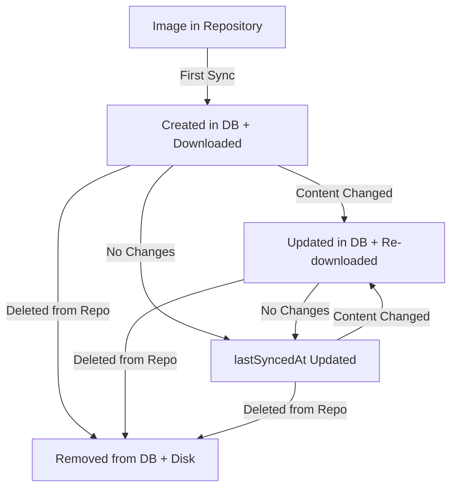

# Image Lifecycle Management

## Overview

NextDocs implements comprehensive lifecycle management for repository images, ensuring that images are properly tracked, synchronized, and cleaned up when deleted.

## Database Tracking

All synced images are tracked in the `RepositoryImage` model:

```prisma
model RepositoryImage {
  id              String    @id
  repositoryId    String
  filePath        String    // Original path in repo (e.g., "docs/_img/screenshot.png")
  localPath       String    // Path in /public/img/ (e.g., "img/repo-slug/docs/_img/screenshot.png")
  sha             String    // Git SHA for change detection
  size            Int       // File size in bytes
  mimeType        String?   // e.g., "image/png"
  
  createdAt       DateTime
  updatedAt       DateTime
  lastSyncedAt    DateTime
  
  repository      Repository @relation(fields: [repositoryId], references: [id], onDelete: Cascade)
}
```

## Sync Process

### 1. Image Discovery
- Scans repository tree recursively for image files
- **Filtered to content directories only**: `docs/`, `blog/`, `api-specs/`
- Identifies images by extension: `.png`, `.jpg`, `.jpeg`, `.gif`, `.svg`, `.webp`, `.ico`, `.bmp`
- **Excludes** images in other directories (src, components, etc.) for efficiency and relevance

### 2. Change Detection
- Compares Git SHA of each image with database record
- Only syncs images that:
  - Are new (not in database)
  - Have changed (different SHA)

### 3. File Organization
Images are stored with this structure:
```
/public/img/{repository-slug}/{original-path}
```

**Examples:**
```
Repository path                    →  Local path
━━━━━━━━━━━━━━━━━━━━━━━━━━━━━━━━━━━━━━━━━━━━━━━━━━━━━━━━━━━━━
docs/_img/screenshot.png           →  /public/img/nextdocs/docs/_img/screenshot.png
assets/diagrams/flow.svg           →  /public/img/nextdocs/assets/diagrams/flow.svg
guides/getting-started/banner.jpg  →  /public/img/nextdocs/guides/getting-started/banner.jpg
icon.png                           →  /public/img/nextdocs/icon.png
```

### 4. Database Updates
- **New images**: Create database record + download file
- **Changed images**: Update database record + replace file
- **Unchanged images**: Update `lastSyncedAt` timestamp only
- **Orphaned images**: Delete database record + remove file

## Lifecycle States



## Usage in Markdown

### Option 1: Absolute Path (Recommended)
```markdown

```

### Option 2: Relative Path (Auto-resolved)
```markdown


```

The `MarkdownImage` component automatically:
1. Detects relative paths
2. Removes `../` or `./` prefixes
3. Prepends `/img/` to resolve to synced location

## API Functions

### `syncRepositoryImages()`
Main sync function called during repository sync.

**Parameters:**
- `owner`, `repo`, `token`: GitHub credentials
- `repositoryId`: Database ID for tracking
- `repositorySlug`: For organizing files
- `branch`: Branch to sync from

**Returns:**
```typescript
{
  synced: number      // New images added
  updated: number     // Existing images updated
  deleted: number     // Orphaned images removed
  skipped: number     // Unchanged images
  errors: string[]    // Any errors encountered
}
```

**Process:**
1. Fetch repository tree from GitHub
2. Filter for image files
3. Compare with database records (SHA-based)
4. Download new/changed images
5. Remove orphaned images
6. Update database

### `cleanupRepositoryImages()`
Removes all images for a repository.

**Use cases:**
- Repository deleted
- `syncImages` disabled
- Manual cleanup needed

**Parameters:**
- `repositoryId`: Repository to clean up

**Returns:**
- Number of images cleaned

## Configuration

Enable image syncing per repository:

```typescript
await prisma.repository.update({
  where: { id: repositoryId },
  data: { syncImages: true }
})
```

Or via Admin UI:
1. Go to **Admin → Repositories**
2. Edit repository
3. Check **"Sync Images"**
4. Save and run sync

## Performance Considerations

### SHA-Based Change Detection
- Only downloads changed images
- Skips unchanged images (just updates timestamp)
- Efficient for large repositories

### Incremental Sync
- First sync: Downloads all images
- Subsequent syncs: Only changes
- Orphan cleanup: Automatic

### Bandwidth Usage
Example repository with 50 images (5MB total):
- **First sync**: ~5MB download
- **Second sync** (2 images changed, 1 added, 1 deleted):
  - Download: ~200KB (changed + new)
  - Delete: 1 file
  - Skip: 47 files

## Storage Structure

```
/public/img/
├── nextdocs/                    (repository slug)
│   ├── docs/
│   │   ├── _img/
│   │   │   ├── screenshot.png
│   │   │   └── diagram.svg
│   │   └── guides/
│   │       └── banner.jpg
│   └── assets/
│       └── logo.png
└── another-repo/
    └── images/
        └── icon.png
```

## Cleanup Scenarios

### 1. Image Deleted from Repository
- Detected during next sync
- Removed from `/public/img/`
- Database record deleted
- Logged: `🗑️  Removed: path/to/image.png`

### 2. Repository Deleted
- Triggered by `onDelete: Cascade`
- All images automatically removed from database
- Call `cleanupRepositoryImages()` to remove files

### 3. Sync Disabled
- Images remain in `/public/img/`
- Database records preserved
- No updates on subsequent syncs
- Call `cleanupRepositoryImages()` to manually clean

## Monitoring

### Sync Logs
Each sync reports:
```
📊 Images: 5 added, 2 updated, 1 deleted, 42 unchanged
```

### Database Queries
```sql
-- Total images per repository
SELECT r.name, COUNT(i.id) as image_count, SUM(i.size) as total_size
FROM "Repository" r
LEFT JOIN "RepositoryImage" i ON r.id = i."repositoryId"
GROUP BY r.id;

-- Recently synced images
SELECT * FROM "RepositoryImage"
WHERE "lastSyncedAt" > NOW() - INTERVAL '1 hour'
ORDER BY "lastSyncedAt" DESC;

-- Orphaned records (file doesn't exist)
-- Run maintenance script to clean these up
```

## Error Handling

Common errors and solutions:

### "Failed to sync image.png: 404"
- Image deleted between tree fetch and download
- Safe to ignore, will be cleaned on next sync

### "Failed to remove orphaned image"
- File might be locked or deleted manually
- Database record still removed
- File cleanup will retry on next sync

### "Permission denied writing to /public/img/"
- Check file system permissions
- Ensure Next.js has write access to /public

## Best Practices

1. **Enable for documentation repos only**
   - Don't sync images for code-only repositories
   - Reduces storage and sync time

2. **Optimize images before commit**
   - Compress images in repository
   - Use appropriate formats
   - Keep file sizes reasonable

3. **Use consistent paths**
   - `docs/_img/` for documentation images
   - `assets/` for shared resources
   - Makes markdown more portable

4. **Monitor storage**
   - Check `/public/img/` size periodically
   - Clean up unused repositories
   - Consider CDN for large image sets

5. **Test in development**
   - Enable `syncImages` on test repo first
   - Verify paths resolve correctly
   - Check image loading performance
