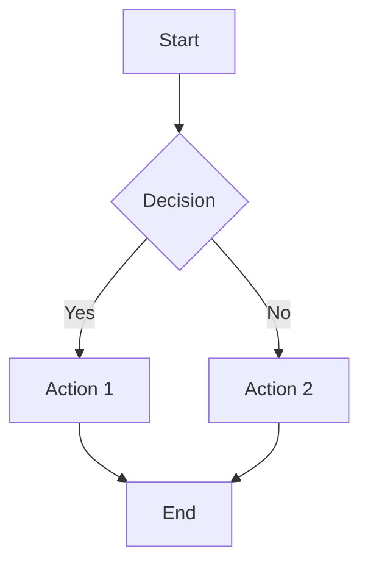
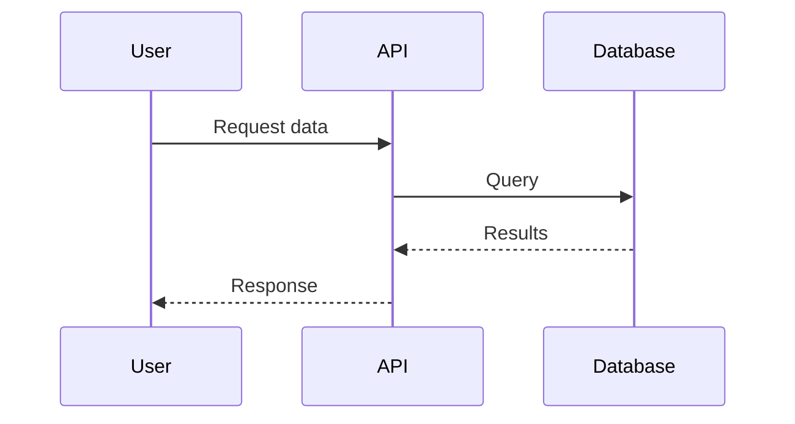
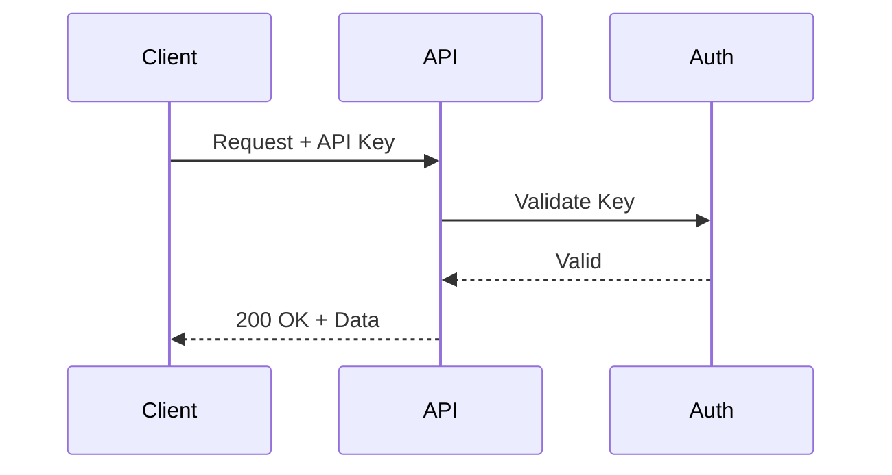

# Markdown Syntax

Learn how to write rich, formatted content using Markdown in NextDocs.

## Basic Formatting

### Headers

```markdown
# H1 - Main Title
## H2 - Section
### H3 - Subsection
#### H4 - Sub-subsection
##### H5 - Smaller heading
###### H6 - Smallest heading
```

### Text Formatting

```markdown
**Bold text** or __bold text__
*Italic text* or _italic text_
***Bold and italic*** or ___bold and italic___
~~Strikethrough text~~
`Inline code`
```

**Result**:
- **Bold text**
- *Italic text*
- ***Bold and italic***
- ~~Strikethrough~~
- `Inline code`

## Lists

### Unordered Lists

```markdown
- Item 1
- Item 2
  - Nested item 2.1
  - Nested item 2.2
- Item 3
```

**Result**:
- Item 1
- Item 2
  - Nested item 2.1
  - Nested item 2.2
- Item 3

### Ordered Lists

```markdown
1. First item
2. Second item
   1. Nested item 2.1
   2. Nested item 2.2
3. Third item
```

**Result**:
1. First item
2. Second item
   1. Nested item 2.1
   2. Nested item 2.2
3. Third item

### Task Lists

```markdown
- [x] Completed task
- [ ] Incomplete task
- [ ] Another task
```

**Result**:
- [x] Completed task
- [ ] Incomplete task
- [ ] Another task

## Links

### Basic Links

```markdown
[Link text](https://example.com)
[Link with title](https://example.com "Hover text")
```

### Internal Links (Between Docs)

```markdown
[Same folder](./other-page.md)
[Parent folder](../index.md)
[Subfolder](./guides/tutorial.md)
```

**Important**: Always use `.md` extension! NextDocs will convert it to the proper URL.

### Reference Links

```markdown
[Link text][ref]
[Another link][ref2]

[ref]: https://example.com
[ref2]: https://another-example.com
```

## Images

### Local Images

Store images in an `img/` or `images/` directory within your documentation folder:

```markdown


```

**Recommended structure**:
```
docs/
├── getting-started/
│   ├── index.md
│   └── img/
│       ├── dashboard.png
│       └── setup-wizard.png
├── guides/
│   ├── tutorial.md
│   └── img/
│       └── workflow.png
```

### External Images

You can also reference external images:

```markdown

```

**Best practices**:
- **Use `img/` folder**: Store images in an `img/` subfolder next to your markdown files
- **Descriptive filenames**: Use clear names like `user-dashboard.png` instead of `image1.png`
- **Alt text**: Always provide descriptive alt text for accessibility
- **Optimize**: Compress large images before committing (aim for <500KB per image)
- **Formats**: PNG for screenshots/diagrams, JPG for photos, SVG for logos/icons
- **Relative paths**: Use `./img/` for same folder, `../img/` for parent folder

## Blockquotes

```markdown
> This is a blockquote
> It can span multiple lines

> **Tip**: You can use formatting inside blockquotes!
```

**Result**:
> This is a blockquote
> It can span multiple lines

> **Tip**: You can use formatting inside blockquotes!

## Code Blocks

### Inline Code

```markdown
Use the `print()` function to output text.
```

### Code Blocks with Syntax Highlighting

````markdown
```python
def hello_world():
    print("Hello, World!")
```
````

**Result**:
```python
def hello_world():
    print("Hello, World!")
```

### Supported Languages

NextDocs supports syntax highlighting for:

- JavaScript/TypeScript: `javascript`, `typescript`, `js`, `ts`
- Python: `python`, `py`
- Java: `java`
- C#: `csharp`, `cs`
- Go: `go`
- Rust: `rust`
- SQL: `sql`
- Bash/Shell: `bash`, `sh`, `shell`
- JSON: `json`
- YAML: `yaml`, `yml`
- Markdown: `markdown`, `md`
- And many more!

### Code with Filename

````markdown
```typescript:app.ts
export function greet(name: string): string {
  return `Hello, ${name}!`;
}
```
````

## Inline Icons :palette:

NextDocs supports inline icons using special syntax:

### Lucide Icons (Default)

```markdown
:rocket: Launch your app
:check-circle: Task completed
:alert-triangle: Warning message
```

**Result**:
:rocket: Launch your app  
:check-circle: Task completed  
:alert-triangle: Warning message

### FluentUI Icons

```markdown
:#fluentui Add: Create new item
:#fluentui Delete: Remove item
:#fluentui Settings: Configure options
```

See the [Icon Libraries](./icons/index.md) section for complete lists and browsing tools.

## Tables :table:

```markdown
| Column 1 | Column 2 | Column 3 |
|----------|----------|----------|
| Row 1    | Data     | More data|
| Row 2    | Data     | More data|
```

**Result**:

| Column 1 | Column 2 | Column 3 |
|----------|----------|----------|
| Row 1    | Data     | More data|
| Row 2    | Data     | More data|

### Table Alignment

```markdown
| Left aligned | Center aligned | Right aligned |
|:-------------|:--------------:|--------------:|
| Left         | Center         | Right         |
| Text         | Text           | Text          |
```

**Result**:

| Left aligned | Center aligned | Right aligned |
|:-------------|:--------------:|--------------:|
| Left         | Center         | Right         |
|Text          |Text           |Text          |

## Horizontal Rules :minus:

```markdown
---
***
___
```

All three create a horizontal line:

---

## Mermaid Diagrams :workflow:

NextDocs supports Mermaid for creating diagrams directly in markdown!

### Flowchart

````markdown

````

### Sequence Diagram

````markdown

````

### Other Diagram Types

Mermaid supports many diagram types:
- Flowcharts (`graph`)
- Sequence diagrams (`sequenceDiagram`)
- Class diagrams (`classDiagram`)
- State diagrams (`stateDiagram`)
- Gantt charts (`gantt`)
- Pie charts (`pie`)
- Entity relationship diagrams (`erDiagram`)

[Learn more about Mermaid syntax](https://mermaid.js.org/)

## Special Formatting :alert-triangle:

### Callouts/Admonitions

Use blockquotes with emoji for callouts:

```markdown
> :bulb: **Tip**: This is helpful information!

> :warning: **Warning**: Be careful with this!

> :x: **Error**: Something went wrong!

> :information_source: **Note**: Additional context here.
```

**Result**:

> :bulb: **Tip**: This is helpful information!

> :warning: **Warning**: Be careful with this!

## Escaping Special Characters :link:

To display special characters literally, use backslash `\`:

```markdown
\*Not italic\*
\[Not a link\]
\:Not an icon\:
```

## Best Practices :lightbulb:

1. **Use headers hierarchically** - Don't skip levels (H1 → H2 → H3, not H1 → H3)
2. **One H1 per page** - The page title should be the only H1
3. **Break up long content** - Use headers, lists, and tables for scannability
4. **Add alt text to images** - Important for accessibility
5. **Use code blocks for code** - Don't just use inline code for multi-line examples
6. **Keep lines reasonable** - Break long lines for better readability in editors
7. **Use consistent formatting** - Pick a style and stick to it

## Common Mistakes :x:

### Don't mix HTML and Markdown

❌ **Avoid**:
```markdown
<div>
**Bold text**
</div>
```

✅ **Use pure Markdown**:
```markdown
**Bold text**
```

### Don't forget blank lines

❌ **Wrong**:
```markdown
## Header
Paragraph text immediately after
```

✅ **Right**:
```markdown
## Header

Paragraph text with blank line before it
```

### Don't use improper list formatting

❌ **Wrong**:
```markdown
- Item 1
-Item 2 (missing space)
```

✅ **Right**:
```markdown
- Item 1
- Item 2
```

## Complete Example :package:

Here's a complete page using various Markdown features:

```markdown
# API Authentication Guide

Learn how to authenticate with our API using API keys.

## :rocket: Quick Start

Get started in 3 easy steps:

1. Generate an API key from your dashboard
2. Include it in request headers
3. Start making requests!

## :key: Getting Your API Key

Navigate to **Settings** → **API Keys** and click **Generate New Key**.

> :warning: **Important**: Keep your API key secret! Never commit it to version control.

## :computer: Example Request

```bash
curl -H "Authorization: Bearer YOUR_API_KEY" \
     https://api.example.com/v1/users
```

## :bar_chart: Authentication Flow



## :books: Next Steps

- Read the [API Reference](./api-reference.md)
- Learn about [Rate Limits](./rate-limits.md)
- Check out [Code Examples](./examples.md)
```

## Next Steps :compass:

- Browse [Icon Libraries](./icons/index.md) to enhance your docs
- Learn about [Repository Structure](./structure.md) for organization
- Review [Navigation & Metadata](./metadata.md) for menu configuration
- See [Publishing Your Docs](./publishing.md) to go live
