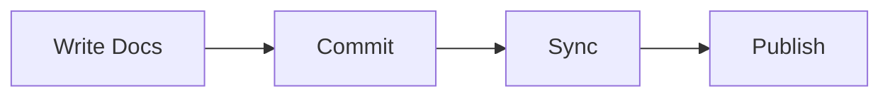

# Quick Start Guide

Get your documentation up and running in 5 minutes!

## :zap: 5-Minute Quickstart

### 1. Download the Template

Start with our sample template:

```bash
# Download the template
curl -O https://your-nextdocs-instance.com/api/guide/download-sample

# Extract the files
unzip sample-docs.zip
```

### 2. Customize Your Content

Edit the markdown files to match your needs:

```markdown
# Your First Page

Welcome to your documentation! :wave:

## Features

- :check: Easy to write
- :check: Looks great
- :check: Auto-syncs
```

### 3. Add to Your Repository

Commit and push your changes:

```bash
git add docs/
git commit -m "Add documentation"
git push origin main
```

### 4. Sync with NextDocs

In the Admin panel:

1. Click :refresh-cw: **Sync Now**
2. Wait for completion
3. View your docs!

## :art: Customization Options

### Adding Icons

Use Lucide icons in navigation:

```json
{
  "index": {
    "title": "Home",
    "icon": "Home"
  }
}
```

Use inline icons in content:

```markdown
:rocket: Launch your project
:shield: Security features
:#fluentui Settings: Advanced configuration
```

### Creating Links

Link to other pages in your docs:

```markdown
See [Installation](./installation.md) for details.
Check out the [User Guide](../user-guide/index.md).
```

### Code Examples

Add syntax-highlighted code blocks:

````markdown
```typescript
interface User {
  name: string
  email: string
}
```
````

### Diagrams

Create flowcharts with Mermaid:

````markdown

````

## :books: Example Documentation

Here's a complete example page:

```markdown
# Feature Overview

Welcome to our amazing feature! :sparkles:

## What It Does

This feature allows you to:

- :check-circle: Process data automatically
- :check-circle: Generate reports
- :check-circle: Export results

## Getting Started

1. Navigate to **Settings** :settings:
2. Enable the feature
3. Configure your preferences

## Code Example

```python
from myapp import Feature

feature = Feature()
feature.process()
```

## Next Steps

Learn more about [Advanced Usage](./advanced.md).
```

## :rocket: Advanced Topics

Once you're comfortable with the basics:

1. Explore [nested categories](../user-guide/index.md)
2. Set up auto-sync schedules
3. Customize your navigation with `_meta.json`
4. Add Mermaid diagrams for visual documentation

## :tada: You're Ready!

You now have everything you need to create great documentation. Happy writing!

### Need More Help?

- Check the [full documentation guide](/guide)
- Contact your administrator
- Review the sample template files
