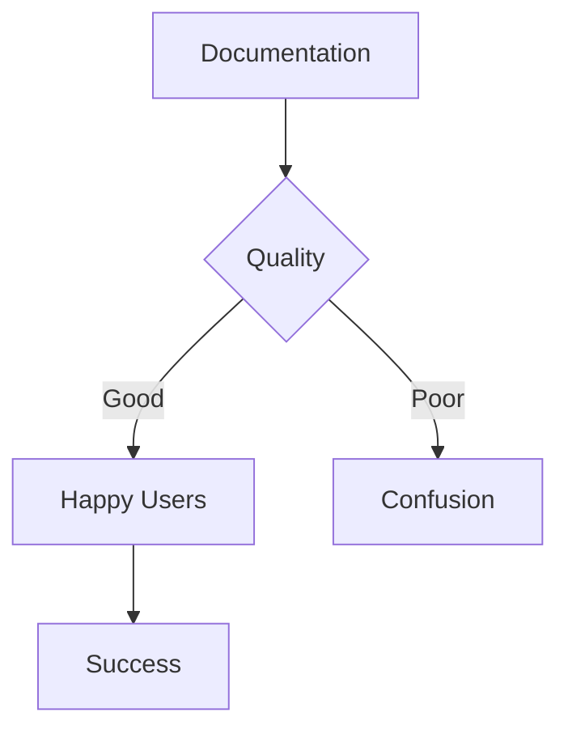

# Features Overview

Explore the powerful features available in NextDocs.

## :zap: Content Features

### Markdown Support

Write naturally using standard Markdown:

- Headers, lists, and formatting
- Code blocks with syntax highlighting
- Tables and task lists
- Blockquotes and horizontal rules

### Inline Icons

Add visual elements inline:

- :rocket: Lucide icons: `:rocket:`
- :#fluentui Add: FluentUI icons: `:#fluentui Add:`
- Supports both PascalCase and kebab-case

### Mermaid Diagrams

Create visual diagrams directly in your markdown:



### Code Highlighting

Syntax highlighting for all major languages:

```typescript
interface Documentation {
  title: string
  content: string
  category: string
}

const doc: Documentation = {
  title: "Features",
  content: "Amazing content",
  category: "user-guide"
}
```

```python
def create_docs():
    """Create amazing documentation"""
    return {
        "title": "Features",
        "content": "Amazing content",
        "category": "user-guide"
    }
```

## :mag: Search Features

### Full-Text Search

Search across all your documentation:

- **Fast**: Powered by PostgreSQL full-text search
- **Relevant**: Results ranked by relevance
- **Filtered**: Search specific categories or types
- **Highlighted**: See matching excerpts

### Search Everything

Use the global search (⌘K or Ctrl+K) to find:

- Documentation pages
- Blog posts
- API specifications
- Feature requests

## :link: Navigation Features

### Automatic TOC

Table of contents is generated automatically based on:

- Folder structure
- `_meta.json` configurations
- Page titles

### Breadcrumbs

Navigate easily with breadcrumb trails showing your current location.

### Smart Links

Links are automatically processed:

- `.md` extensions removed
- Relative paths resolved correctly
- External links open in new tabs

## :repeat: Sync Features

### Auto-Sync

Configure automatic synchronization:

- Set sync frequency (hourly, daily, etc.)
- Background worker processes syncs
- Status indicators show sync state

### Manual Sync

Trigger syncs on-demand:

- Click the sync button
- Immediate processing
- Real-time feedback

### Sync Logs

Review detailed sync history:

- Files added, changed, deleted
- Success/failure status
- Error messages and warnings
- Performance metrics

## :shield: Security Features

### Authentication

Secure access control:

- Azure AD SSO integration
- Role-based access (User, Editor, Admin)
- Session management

### Repository Security

Protect your source code:

- Encrypted credential storage
- Secure Git/Azure DevOps access
- No public repository exposure

## :art: Customization Features

### Icons

Customize your navigation:

- 1000+ Lucide icons
- Microsoft FluentUI icons
- Custom icon mapping in `_meta.json`

### Categories

Organize content your way:

- Unlimited nesting
- Custom ordering
- Metadata for each category

### Theming

Built-in dark/light mode:

- Automatic detection
- Manual toggle
- Persistent preference

## :chart_with_upwards_trend: Analytics Features

### Usage Tracking

Monitor documentation usage:

- Page views
- Popular content
- User engagement
- Search queries

### Performance Metrics

Track system health:

- Sync performance
- Search response times
- Error rates

## :wrench: Admin Features

### Repository Management

Manage all your doc repositories:

- Add/edit/delete repositories
- Test connections
- Configure sync settings
- View statistics

### User Management

Control access:

- Manage user roles
- Track user activity
- Email notifications

### Feature Requests

Built-in feedback system:

- Users can submit requests
- Categorization and voting
- Status tracking
- DevOps integration

## Next Steps

Learn about [Advanced Topics](./advanced.md) to unlock more powerful features.
